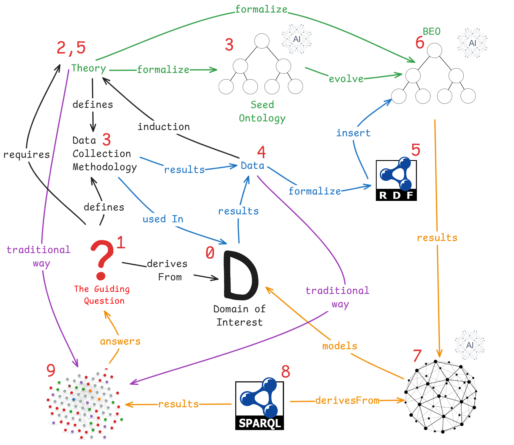

# Business Ecosystem Analysis & Representation (BEAR) Framework

Traditional analytical frameworks often struggle to capture the complexity of business ecosystems, leading to ecosystem blindspots and missed opportunities. Following a semantic approach, we introduce the Business Ecosystem Analysis & Representation (BEAR) framework to uncover these blindspots. This approach leverages domain, seed ontologies, and empirical data to construct insightful knowledge graphs and context-driven
visualizations, enabling question-driven analysis. Furthermore, we applied BEAR to the wind energy ecosystem
to demonstrate its value using data from 35 companies extracted from WindEnergy Hamburg 2024. Guided by co-
developed questions with industry experts from a leading manufacturer, our analysis revealed the BEAR's ability
to map organizational positioning, interdependencies, and previously hidden wind energy ecosystem supply
chain dynamics. These preliminary results demonstrate BEAR's effectiveness in unlocking deeper ecosystem
understanding beyond syntactic methods, offering a scalable, semantic toolset that promises to advance strategic
planning and ecosystem knowledge representation in business ecosystem analysis.

# Repository Overview 📂

This repository contains the tools, data, and resources for applying the BEAR Framework:

- **📊 Figures**: Diagrams and illustrations of the BEAR Framework
  - `BEARFramework.svg`: Visual representation of the framework's architecture
  - `Blindspots.svg`: Visualization of business ecosystem blindspots concept

- **🔄 KG&Data**: Knowledge Graph and Dataset
  - `KG.rdf`: Knowledge graph in RDF format containing WindEnergy Hamburg 2024 data (35 companies)

- **🎯 OntologForum2025PresentationFiles**: Presentation materials from Ontology Summit 2025
  - `Presentation.pdf`: Slides from the presentation "Beyond Blind Spots"

- **🧩 ontology**: Business Ecosystem Ontology used in the Research Article
  - `BEO.rdf`: Business Ecosystem Ontology in RDF format

- **🧪 OWL2DL-RL_Test/**: Testing for OWL2DL Limitations
  - `PropTest.rdf`: Test dataset for property reasoning
  - `proptestDL.py`: Script for testing Description Logic reasoning
  - `proptestRL.py`: Script for testing Rule Language reasoning

- **❓ Queries/**: Sample SPARQL queries
  - `Querry1.rq`, `Querry2.rq`: Example queries to extract insights from the knowledge graph

- **📝 Survey**: Data Collection Methodology
  - `survey.pdf`: Survey template for WindEnergy Hamburg 2024

# Talks & Publications 🎓

## 📢 Talks
- [Ontology Summit 2025](https://ontologforum.com/index.php/OntologySummit2025): "Beyond Blind Spots: How Semantic Strategies Reveal Hidden Insights in the Business World"

<figure>
  
  <figcaption><strong>Figure 1:</strong> This overview illustrates the BEAR framework, which progresses from a guiding question (1) to a final visualization (9). The numbers indicate the logical sequence (steps with the same number occur simultaneously), while colors distinguish different approaches: blue for data-driven, green for theoretical, orange for integrated, and purple for traditional literature methods.
  
Typically, questions trigger sequential changes in the framework's components (starting at 1). But components can be reused. The same component state (e.g., a completed survey) might provide answers to several questions without needing modification. However the same might not be true for other components, (e.g, visualization, knowledge graph, querry)</figcaption>
</figure>

# Future Work

- Structural and Contextual validation techniques for the BEAR framework Components (OntoClean, Expert validation, etc.)
- Integration of BEAR with other frameworks (e.g., Business Model Canvas, Value Proposition Canvas)
