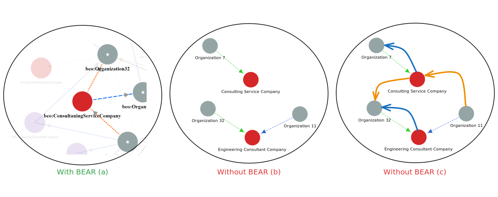

# Business Ecosystem Analysis & Representation (BEAR) Framework

Traditional analytical frameworks often struggle to capture the complexity of business ecosystems, leading to ecosystem blindspots and missed opportunities. Following a semantic approach, we introduce the Business Ecosystem Analysis & Representation (BEAR) framework to uncover these blindspots. This approach leverages domain, seed ontologies, and empirical data to construct insightful knowledge graphs and context-driven
visualizations, enabling question-driven analysis. Furthermore, we applied BEAR to the wind energy ecosystem
to demonstrate its value using data from 35 companies extracted from WindEnergy Hamburg 2024. Guided by co-
developed questions with industry experts from a leading manufacturer, our analysis revealed the BEAR's ability
to map organizational positioning, interdependencies, and previously hidden wind energy ecosystem supply
chain dynamics. These preliminary results demonstrate BEAR's effectiveness in unlocking deeper ecosystem
understanding beyond syntactic methods, offering a scalable, semantic toolset that promises to advance strategic
planning and ecosystem knowledge representation in business ecosystem analysis.

# Repository Overview

This repository contains the tools, data, and resources for applying the BEAR Framework:

- **BEV/**: Business Ecosystem Visualization tool and resources
  - `README.md`: Documentation for the visualization tool
  - `gif/`: Contains animated visualizations of business ecosystems

- **figures/**: Diagrams and illustrations of the BEAR Framework
  - `BEARFramework.svg`: Visual representation of the framework's architecture
  - `Blindspots.svg`: Visualization of business ecosystem blindspots concept

- **KG&Data/**: Knowledge Graph and dataset resources
  - `KG.rdf`: Core knowledge graph in RDF format containing business ecosystem relationships

- **OntologForum2025PresentationFiles/**: Presentation materials from Ontology Summit 2025
  - `Presentation.pdf`: Slides from the "Beyond Blind Spots" presentation

- **ontology/**: Semantic models for business ecosystem analysis
  - `BEO.rdf`: Business Ecosystem Ontology in RDF format

- **OWL2DL-RL_Test/**: Testing tools for reasoning capabilities
  - `PropTest.rdf`: Test dataset for property reasoning
  - `proptestDL.py`: Script for testing Description Logic reasoning
  - `proptestRL.py`: Script for testing Rule Language reasoning

- **Queries/**: Sample SPARQL queries for knowledge graph exploration
  - `Querry1.rq`, `Querry2.rq`: Example queries to extract insights from the knowledge graph

- **Survey/**: Research data and findings
  - `survey.pdf`: Survey template for WindEnergy Hamburg 2024

# Talks & Publications

Ontology Summit 2025: [Beyond Blind Spots: How Semantic Strategies Reveal Hidden Insights in the Business World](https://ontologforum.com/index.php/OntologySummit2025) 

