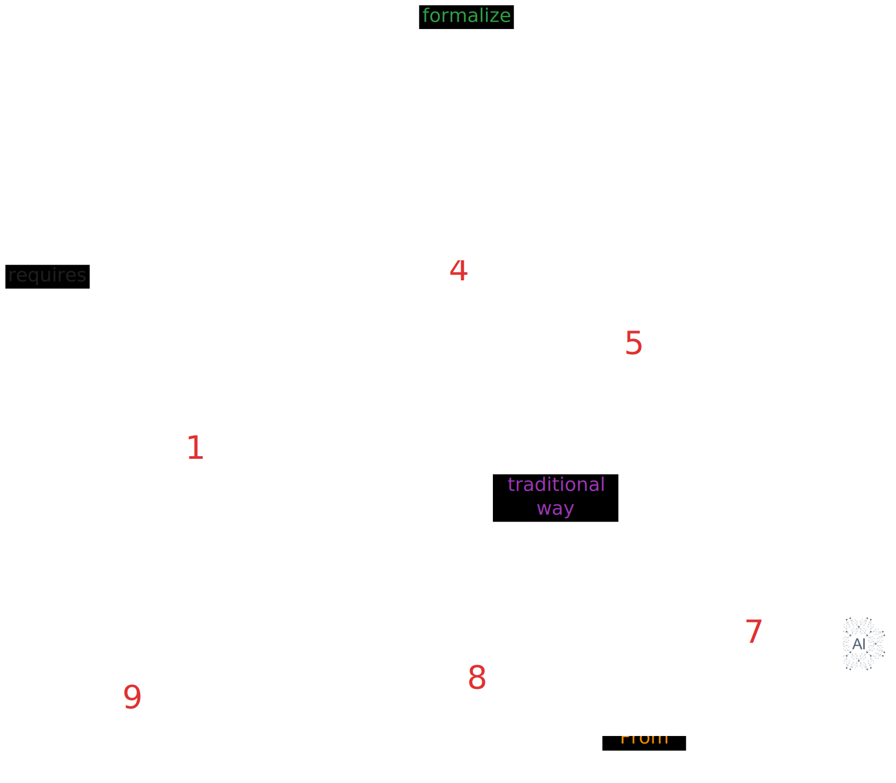

Traditional analytical frameworks often struggle to capture the complexity of business ecosystems, leading to ecosystem blindspots and missed opportunities. Following a semantic approach, we introduce the Business Ecosystem Analysis & Representation (BEAR) framework to uncover these blindspots. This approach leverages domain, seed ontologies, and empirical data to construct insightful knowledge graphs and context-driven
visualizations, enabling question-driven analysis. Furthermore, we applied BEAR to the wind energy ecosystem
to demonstrate its value using data from 35 companies extracted from WindEnergy Hamburg 2024. Guided by co-
developed questions with industry experts from a leading manufacturer, our analysis revealed the BEAR’s ability
to map organizational positioning, interdependencies, and previously hidden wind energy ecosystem supply
chain dynamics. These preliminary results demonstrate BEAR’s effectiveness in unlocking deeper ecosystem
understanding beyond syntactic methods, offering a scalable, semantic toolset that promises to advance strategic
planning and ecosystem knowledge representation in business ecosystem analysis.

