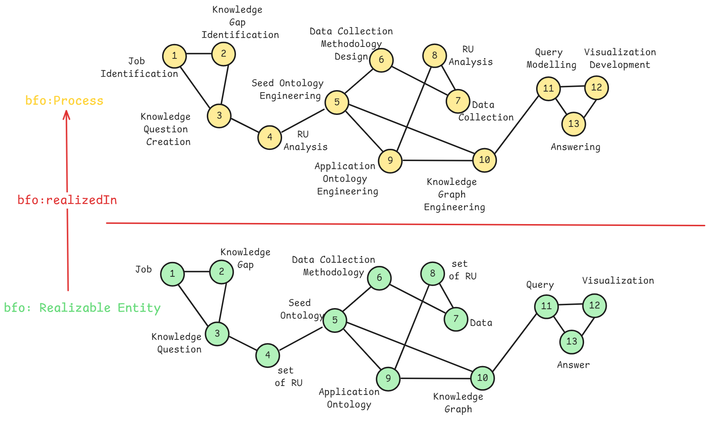

<figure>
  
</figure>

# Value-Driven Business Ecosystem Analysis & Representation (BEAR) Framework

Traditional business ecosystem analysis often creates strategic blind spots by overlooking critical structural complexities. While ontology and knowledge graph engineering (OKGE) offers powerful frameworks for revealing these complexities, 
its contextual utility is undermined by neglecting the core business concept of value. This short paper introduces the Business Ecosystem Analysis and Representation (BEAR) framework, a value-driven semantic approach designed explicitly to bridge this gap. BEAR begins by capturing stakeholder knowledge needs—their knowledge gaps and jobs-to-be-done— as knowledge questions. This ensures OKGE directly targets the delivery of strategic value, resulting in tailored visualizations. We applied BEAR to the wind energy ecosystem, analyzing data from 35 companies collected at WindEnergy Hamburg 2024. Our preliminary findings show BEAR not only effectively addressed predefined stakeholder questions through these visualizations but also uncovered strategic blind spots (e.g., intermediary roles) that conventional analyses would likely miss. 

# Repository Overview 📂

This repository contains the tools, data, and resources for applying the BEAR Framework:

- **📊 Figures**: Diagrams and illustrations of the BEAR Framework
  - `BEAR.png`: Visual representation of the framework's architecture

- **🔄 KG&Data**: Knowledge Graph and Dataset
  - `KG.rdf`: Knowledge graph in RDF format containing WindEnergy Hamburg 2024 data (35 companies)

- **🎯 OntologForum2025PresentationFiles**: Presentation materials from Ontology Summit 2025 
  - `Presentation.pdf`: Slides from the presentation "Beyond Blind Spots"

- **🧩 ontology**: Wind Energy Ecosystem Ontology
  - `BEO.rdf`: Business Ecosystem Ontology in RDF format

- **❓ Queries/**: Sample SPARQL queries
  - `Querry1.rq`, `Querry2.rq`: Example queries to extract insights from the knowledge graph

- **📝 Survey**: Data Collection Methodology
  - `survey.pdf`: Survey template for WindEnergy Hamburg 2024

# Talks & Publications 🎓

## 📢 Talks
- [Ontology Summit 2025](https://ontologforum.com/index.php/OntologySummit2025): "Beyond Blind Spots: How Semantic Strategies Reveal Hidden Insights in the Business World"

# Future Work

- Integrating LLM within the architecture
- Graph Algorithms for pattern recognition
