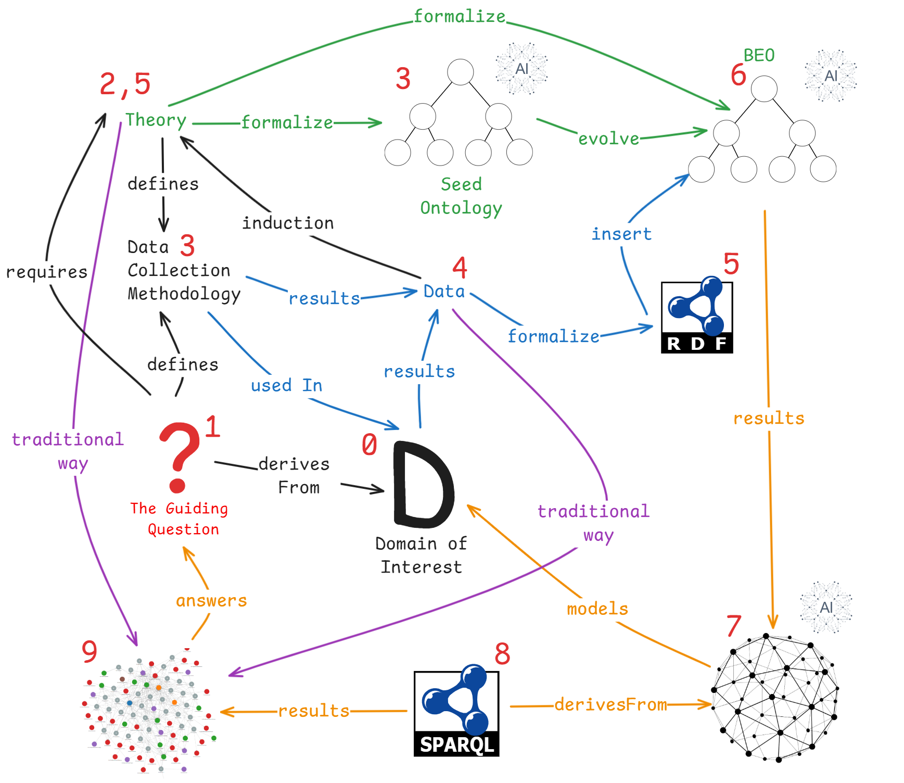

# Business Ecosystem Analysis & Representation (BEAR) Framework

Traditional business ecosystem analysis often creates strategic blind spots by overlooking critical structural complexities. While ontology and knowledge graph engineering (OKGE) offers powerful frameworks for revealing these complexities, 
its contextual utility is undermined by neglecting the core business concept of value. This short paper introduces the Business Ecosystem Analysis and Representation (BEAR) framework, a value-driven semantic approach designed explicitly to bridge this gap. BEAR begins by capturing stakeholder knowledge needs—their knowledge gaps and jobs-to-be-done— as knowledge questions. This ensures OKGE directly targets the delivery of strategic value, resulting in tailored visualizations. We applied BEAR to the wind energy ecosystem, analyzing data from 35 companies collected at WindEnergy Hamburg 2024. Our preliminary findings show BEAR not only effectively addressed predefined stakeholder questions through these visualizations but also uncovered strategic blind spots (e.g., intermediary roles) that conventional analyses would likely miss. 

# Repository Overview 📂

This repository contains the tools, data, and resources for applying the BEAR Framework:

- **📊 Figures**: Diagrams and illustrations of the BEAR Framework
  - `BEARFramework.svg`: Visual representation of the framework's architecture
  - `Blindspots.svg`: Visualization of business ecosystem blindspots concept

- **🔄 KG&Data**: Knowledge Graph and Dataset
  - `KG.rdf`: Knowledge graph in RDF format containing WindEnergy Hamburg 2024 data (35 companies)

- **🎯 OntologForum2025PresentationFiles**: Presentation materials from Ontology Summit 2025
  - `Presentation.pdf`: Slides from the presentation "Beyond Blind Spots"

- **🧩 ontology**: Business Ecosystem Ontology used in the Research Article
  - `BEO.rdf`: Business Ecosystem Ontology in RDF format

- **🧪 OWL2DL-RL_Test/**: Testing for OWL2DL Limitations
  - `PropTest.rdf`: Test dataset for property reasoning
  - `proptestDL.py`: Script for testing Description Logic reasoning
  - `proptestRL.py`: Script for testing Rule Language reasoning

- **❓ Queries/**: Sample SPARQL queries
  - `Querry1.rq`, `Querry2.rq`: Example queries to extract insights from the knowledge graph

- **📝 Survey**: Data Collection Methodology
  - `survey.pdf`: Survey template for WindEnergy Hamburg 2024

# Talks & Publications 🎓

## 📢 Talks
- [Ontology Summit 2025](https://ontologforum.com/index.php/OntologySummit2025): "Beyond Blind Spots: How Semantic Strategies Reveal Hidden Insights in the Business World"

<figure>
  
  <figcaption><strong>Figure 1:</strong> This overview illustrates the BEAR framework, which progresses from a guiding question (1) to a final visualization (9). The numbers indicate the logical sequence (steps with the same number occur simultaneously). At the same time, colors distinguish different approaches: blue for data-driven, green for theoretical, orange for integrated, and purple for traditional literature methods.
  
Typically, questions trigger sequential changes in the framework's components (starting at 1). But components can be reused. The same component state (e.g., a completed survey) might answer several questions without modification. However, the same might not be true for other components (e.g., visualization, knowledge graph, query). </figcaption>
</figure>

# Future Work

- Structural and Contextual validation techniques for the BEAR framework Components (OntoClean, Expert validation, etc.)
- Integration of BEAR with other frameworks (e.g., Business Model Canvas, Value Proposition Canvas)
